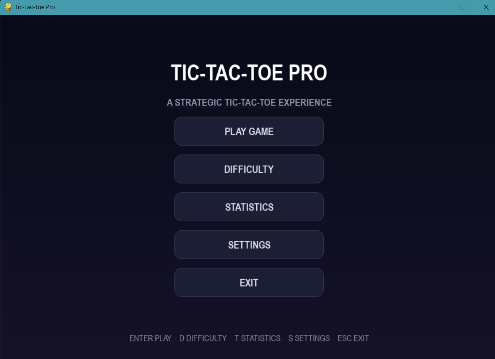
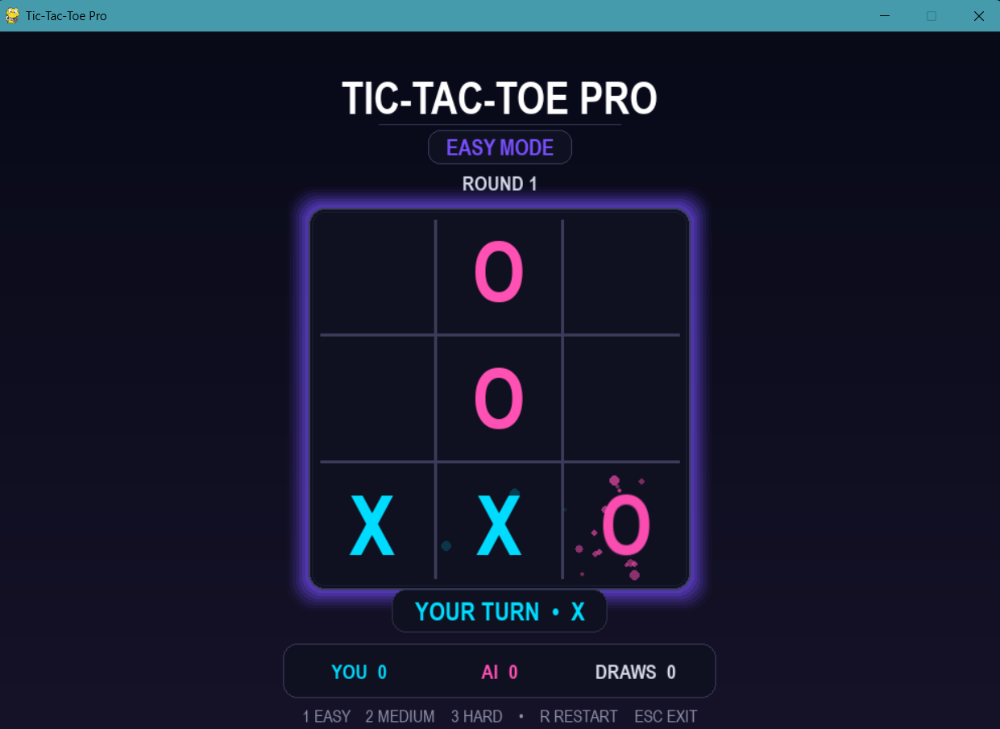
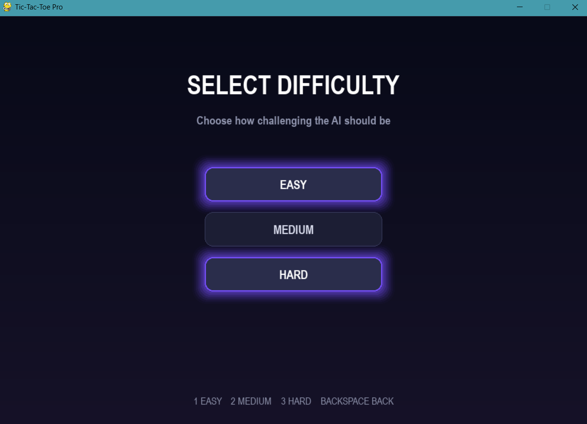
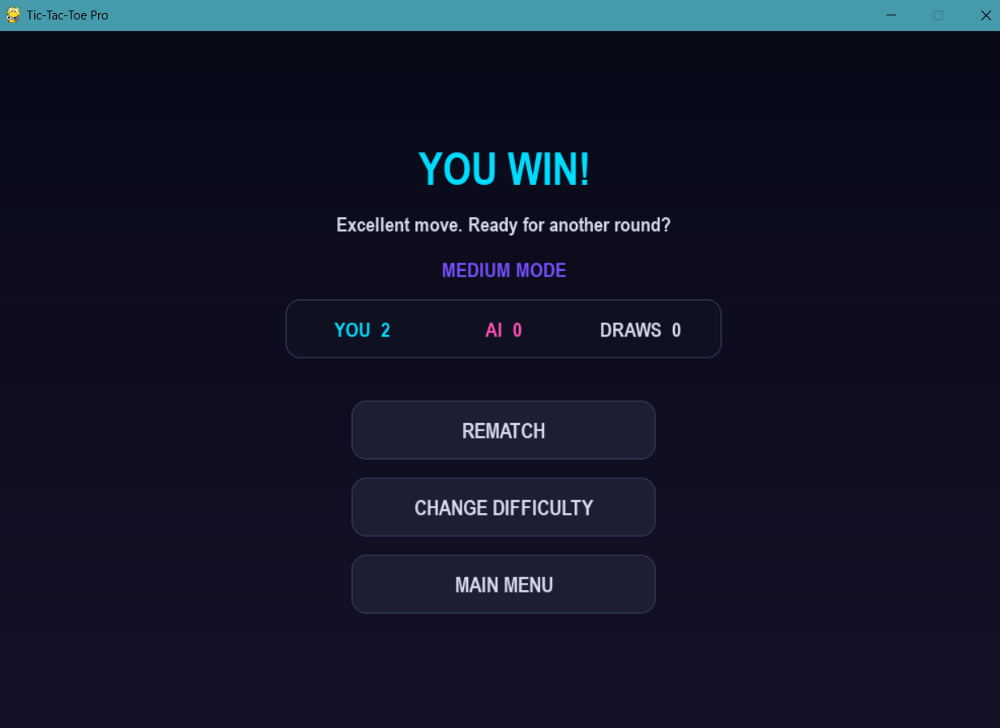
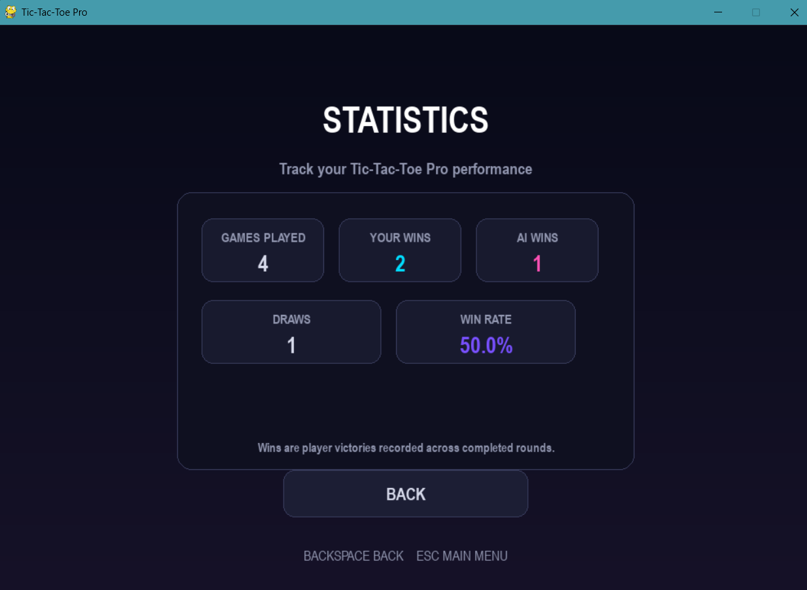
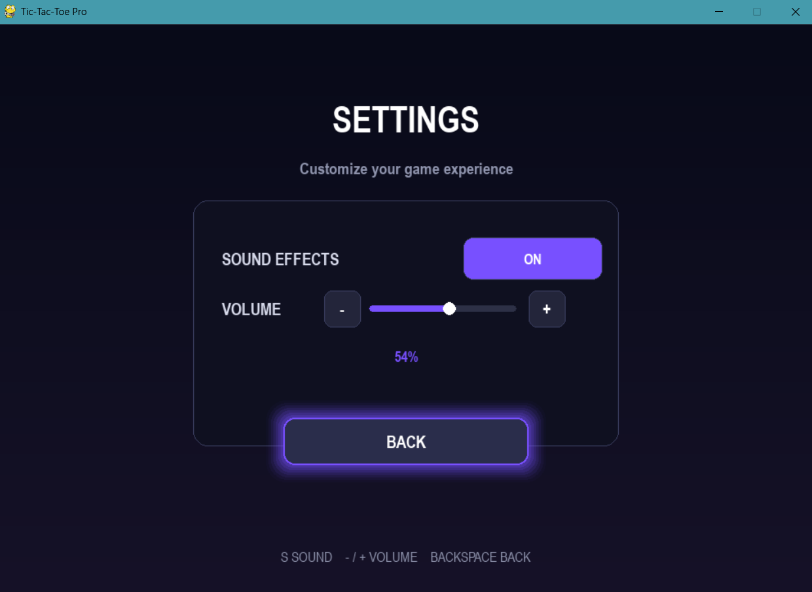

# Tic-Tac-Toe Pro

<p align="center">
  
</p>

<p align="center">
  <strong>A polished Tic-Tac-Toe game built with Python and Pygame.</strong><br>
  Play against an AI, choose your difficulty, track your performance, and customize your game experience.
</p>

<p align="center">
  🎮 <strong>Easy • Medium • Hard</strong> &nbsp;|&nbsp;
  🤖 <strong>AI Opponent</strong> &nbsp;|&nbsp;
  📊 <strong>Statistics</strong> &nbsp;|&nbsp;
  🔊 <strong>Sound Settings</strong>
</p>

---

## 📌 Table of Contents

- [✨ Features](#-features)
- [🖥️ Screenshots](#️-screenshots)
- [🛠️ Tech Stack](#️-tech-stack)
- [📁 Project Structure](#-project-structure)
- [🎮 Game Flow](#-game-flow)
- [🧠 AI Difficulty](#-ai-difficulty)
- [🔊 Settings](#-settings)
- [📊 Statistics](#-statistics)
- [🚀 Quick Start](#-quick-start)
- [🎯 Controls](#-controls)
- [🔮 Future Improvements](#-future-improvements)
- [👩‍💻 Author](#-author)

---

## ✨ Features

### 🎮 Gameplay
- Player vs AI Tic-Tac-Toe
- Round-based gameplay
- Automatic win and draw detection
- Rematch without restarting the application
- Change difficulty between rounds
- Score tracking for player, AI, and draws

### 🤖 AI System
- **Easy** — beginner-friendly moves
- **Medium** — stronger decision-making
- **Hard** — Minimax-based strategic play

### 🎨 Visual Experience
- Clean dark interface
- Neon-style purple glow effects
- Animated X and O moves
- Win animations
- Particle effects
- Hover effects
- Round and status indicators

### 🔊 Audio & Settings
- Procedurally generated sound effects
- Sound effects ON/OFF
- Adjustable volume
- Persistent settings saved in JSON
- No external audio files required for the generated game sounds

### 📊 Statistics
- Games played
- Player wins
- AI wins
- Draws
- Player win rate
- Persistent statistics

---

## 🖥️ Screenshots

### 🏠 Main Menu



### 🎮 Gameplay



### ⚙️ Difficulty Selection



### 🏆 Result Screen



### 📊 Statistics



### 🔊 Settings



---

## 🛠️ Tech Stack

| Technology | Purpose |
|---|---|
| **Python** | Core programming language |
| **Pygame CE** | Game window, rendering, input and animation |
| **Minimax** | Hard-mode AI decision making |
| **JSON** | Persistent settings and statistics |
| **Git & GitHub** | Version control and project hosting |

---

## 📁 Project Structure

```text
Tic-Tac-Toe-Pro/
│
├── assets/
│   ├── fonts/
│   ├── images/
│   │   ├── typing-title.gif
│   │   ├── main-menu.png
│   │   ├── gameplay.png
│   │   ├── difficulty.png
│   │   ├── result.png
│   │   ├── statistics.png
│   │   └── settings.png
│   └── sounds/
│
├── data/
│   ├── settings.json
│   └── statistics.json
│
├── src/
│   ├── ai.py
│   ├── animations.py
│   ├── board.py
│   ├── constants.py
│   ├── game.py
│   ├── hud.py
│   ├── menu.py
│   ├── particles.py
│   ├── settings.py
│   ├── sound_manager.py
│   └── statistics.py
│
├── .gitignore
├── LICENSE
├── README.md
├── main.py
└── requirements.txt
```

---

## 🎮 Game Flow

```text
MAIN MENU
    │
    ├── PLAY GAME
    │      │
    │      └── CURRENT DIFFICULTY
    │              │
    │              └── GAMEPLAY
    │                    │
    │                    ├── PLAYER WIN
    │                    ├── AI WIN
    │                    └── DRAW
    │                           │
    │                           ├── REMATCH
    │                           ├── CHANGE DIFFICULTY
    │                           └── MAIN MENU
    │
    ├── DIFFICULTY
    ├── STATISTICS
    ├── SETTINGS
    └── EXIT
```

---

## 🧠 AI Difficulty

| Mode | Behaviour |
|---|---|
| **Easy** | Uses simpler move selection for a relaxed experience |
| **Medium** | Makes stronger tactical decisions |
| **Hard** | Uses Minimax-based decision making for optimal play |

The difficulty can be changed from the main menu or after completing a round.

---

## 🔊 Settings

The Settings screen provides:

- Sound effects toggle
- Volume control
- Persistent configuration
- Keyboard shortcuts for quick adjustments

Settings are stored in:

```text
data/settings.json
```

---

## 📊 Statistics

The game keeps track of completed rounds and stores:

- Total games played
- Player wins
- AI wins
- Draws
- Player win rate

Statistics are displayed directly inside the game.

---

## 🚀 Quick Start

### 1. Clone the repository

Clone the project from GitHub and open the project folder in your terminal.

### 2. Create a virtual environment

```powershell
python -m venv .venv
```

### 3. Activate the virtual environment

**Windows PowerShell:**

```powershell
.\.venv\Scripts\Activate.ps1
```

### 4. Install dependencies

```powershell
pip install -r requirements.txt
```

### 5. Run the game

```powershell
python main.py
```

---

## 🎯 Controls

### Main Menu

| Key | Action |
|---|---|
| `ENTER` | Select |
| `D` | Difficulty |
| `T` | Statistics |
| `S` | Settings |
| `ESC` | Exit |

### Gameplay

| Key | Action |
|---|---|
| `1` | Easy |
| `2` | Medium |
| `3` | Hard |
| `R` | Restart |
| `ESC` | Exit |

### Difficulty

| Key | Action |
|---|---|
| `1` | Easy |
| `2` | Medium |
| `3` | Hard |
| `BACKSPACE` | Back |

### Settings

| Key | Action |
|---|---|
| `S` | Toggle sound |
| `- / +` | Adjust volume |
| `BACKSPACE` | Back |

---

## 🔮 Future Improvements

Possible future additions:

- Local two-player mode
- Online multiplayer
- More visual themes
- Additional sound packs
- Leaderboard system
- Improved AI analytics
- Exportable player statistics

---

## 👩‍💻 Author

**Navdeep Kaur**

B.Tech CSE — IoT, Cyber Security & Blockchain

Interested in software development, cybersecurity, full-stack development and building practical projects.

---

## 📄 License

This project is licensed under the **MIT License**.

---

<p align="center">
  Built with Python, Pygame and a lot of game logic. 🎮
</p>
